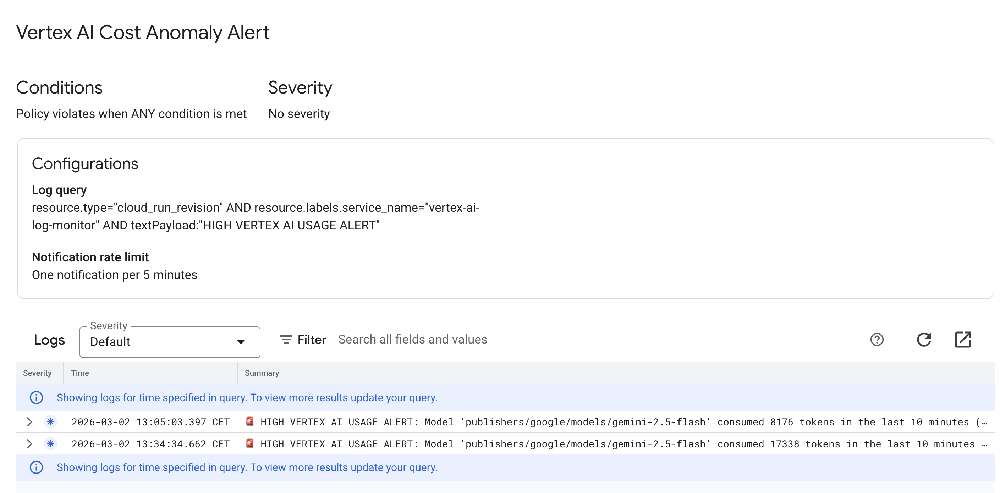

# Gemini Real-Time Cost Tracking

> **Solving the Core Problem:** The primary pain point is that it can take up to 3 days to notice a $1,500 billing anomaly. Reducing that detection time from 3 days down to 5 minutes completely mitigates the risk of runaway AI costs.

This repository provides a complete, production-ready proof of concept to establish real-time tracking of Vertex AI Generative AI token consumption. By leveraging [Vertex AI's native Request/Response Logging capabilities](https://docs.cloud.google.com/vertex-ai/generative-ai/docs/multimodal/request-response-logging), we can monitor usage as it happens and trigger immediate alerts when anomalous or expensive usage patterns are detected.

---

## 🎯 Architecture Overview

This solution utilizes **Scheduled Polling** over a rolling window. It is the most cost-effective and pragmatic approach for detecting high-volume usage spikes.

1. **Vertex AI** streams all request/response payloads (including token usage) directly to **BigQuery**.
2. A **Cloud Scheduler** job triggers a **Cloud Function** on a set interval (e.g., every 10 minutes).
3. The Cloud Function queries the BigQuery table for the last `X` minutes of activity.
4. If a predefined token threshold is breached, the function logs a `HIGH SEVERITY` alert to **Cloud Logging**, which can seamlessly be routed to Slack, PagerDuty, or Email via standard Log-based Alerting.

---

## 🛠️ Prerequisites

1. **Google Cloud SDK**: Ensure `gcloud` is installed and authenticated to your target project.
2. **Python Environment**: Python 3.9+ is recommended.
   ```bash
   python3 -m venv venv
   source venv/bin/activate
   pip install -r requirements.txt
   ```
3. **BigQuery Dataset**: Create a dataset to house the Vertex AI logs.
   ```bash
   bq mk --dataset YOUR_PROJECT_ID:vertex_ai_logs
   ```

---

## 🚀 Step 1: Enable Request/Response Logging

Vertex AI allows you to automatically log all requests directly to BigQuery. Run the setup script to configure a specific model (e.g., `gemini-2.5-flash`) to log 100% of its traffic. *(Note: The SDK will attempt to create the necessary table if it does not exist).*

```bash
python setup_logging.py \
  --project_id YOUR_PROJECT_ID \
  --location us-central1 \
  --dataset_name vertex_ai_logs \
  --table_name gemini_logs \
  --model_name gemini-2.5-flash
```

---

## ⏱️ Step 2: Measure the Logging Delay

To validate the "real-time" nature of this mechanism, you can fire a request to the model and immediately poll BigQuery until the log entry appears.

```bash
python measure_delay.py \
  --project_id YOUR_PROJECT_ID \
  --location us-central1 \
  --dataset_name vertex_ai_logs \
  --table_name gemini_logs \
  --model_name gemini-2.5-flash
```

> **Expected Latency:** In our testing, the delay between the completion of a Vertex AI generation request and the log row appearing in BigQuery is approximately **1.5 to 2 seconds**. 
> *(Note: The very first execution may take slightly longer as BigQuery provisions the table partition).*

---

## 🔍 Step 3: Monitor and Detect Anomalies locally

Once data is streaming into BigQuery, you can execute a rolling-window query to aggregate recent token consumption. Use this script to test your logic locally before deploying the Cloud Function.

```bash
python check_anomalies.py \
  --project_id YOUR_PROJECT_ID \
  --dataset_name vertex_ai_logs \
  --table_name gemini_logs \
  --window_minutes 10
```

---

## ☁️ Step 4: Production Deployment

Deploy the automated Scheduled Polling architecture to your Google Cloud environment. 

### Deployment Steps

1. Make the deployment script executable:
   ```bash
   chmod +x deploy.sh
   ```

2. Open `deploy.sh` and update the configuration variables at the top of the file to match your environment:
   ```bash
   PROJECT_ID="your-project-id"
   REGION="us-central1"
   # ...
   TOKEN_THRESHOLD="5000"
   ```

3. Run the deployment script:
   ```bash
   ./deploy.sh
   ```

**What this script does:**
- Creates a dedicated IAM Service Account (`vertex-log-monitor-sa`).
- Grants it `BigQuery Data Viewer` and `Job User` permissions.
- Deploys the Python Cloud Function (`vertex-ai-log-monitor`).
- Creates a Cloud Scheduler Job to trigger the function automatically based on your defined window.

---

## 🚨 Step 5: Simulate High Usage

To test your deployed Cloud Function and verify your alerting thresholds, use the `trigger_alert.py` script. It repeatedly sends high-token prompts to Vertex AI until your target threshold is breached.

```bash
python trigger_alert.py \
  --project_id YOUR_PROJECT_ID \
  --location us-central1 \
  --model_name gemini-2.5-flash \
  --target_tokens 5500
```

After the script finishes, wait a few seconds and manually trigger your Cloud Scheduler job (or wait for the next cron interval) to see the alert appear in Google Cloud Logging.

---

## 🔔 Step 6: Route Alerts to Slack or Email

Once the Cloud Function detects an anomaly, it prints a specific message to Cloud Logging. You can use Google Cloud's native **Log-based Alerts** to route this message to your preferred notification channels.

We have provided a script to automatically create this Alerting Policy for you.

### How to set it up:

1. Open `setup_alert.sh` and ensure `PROJECT_ID` matches your Google Cloud project.
2. Run the script:
   ```bash
   chmod +x setup_alert.sh
   ./setup_alert.sh
   ```
3. **Go to the GCP Console -> Monitoring -> Alerting**.
4. Find the **'Vertex AI Cost Anomaly Alert'** policy and click Edit.
5. Scroll to the **'Notifications and name'** section, add your preferred Notification Channel (Email, Slack, PagerDuty, etc.), and save.

Now, whenever the rolling window detects a usage spike, your team will be instantly notified via your chosen channel.


